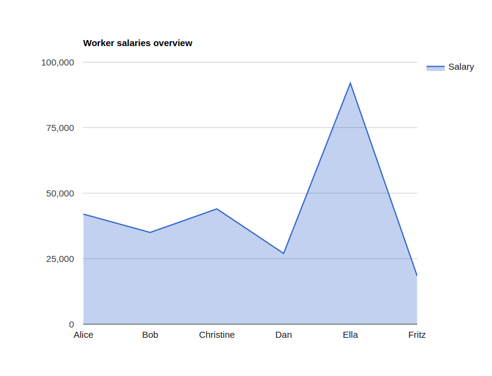
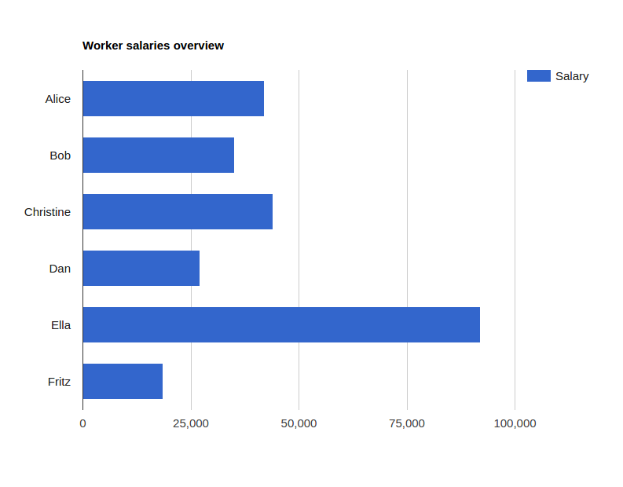
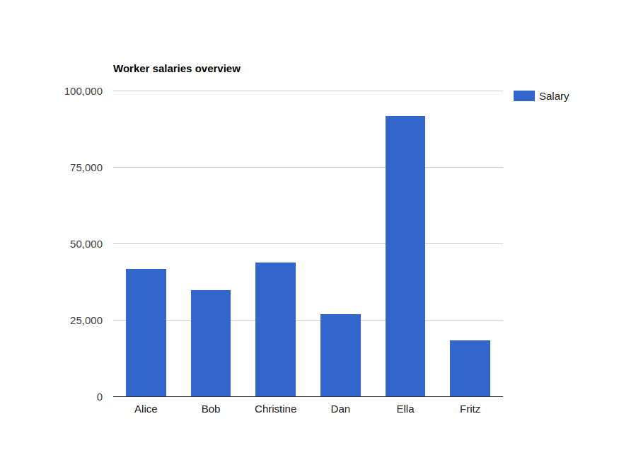
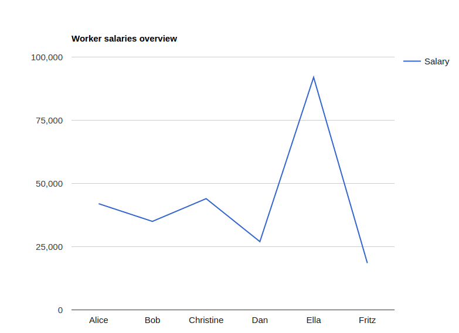
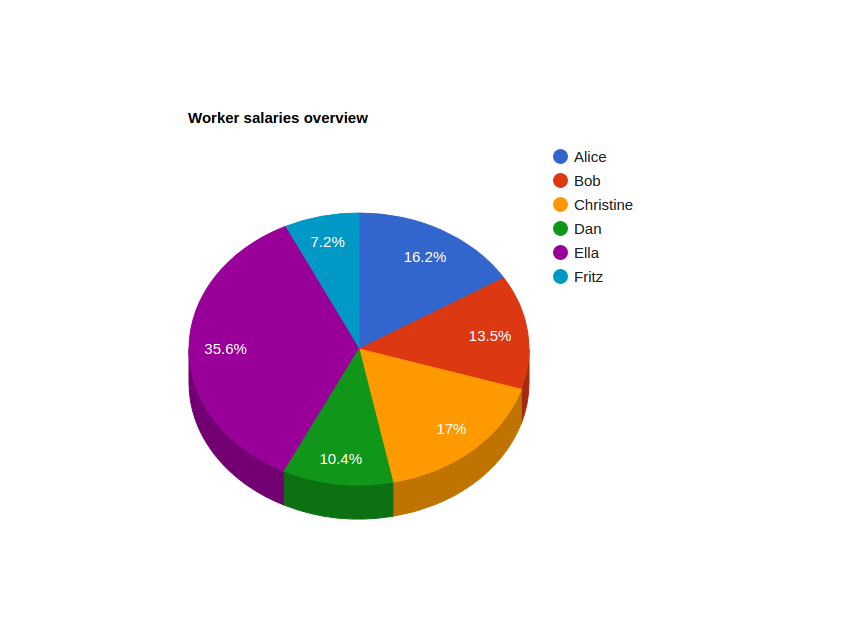
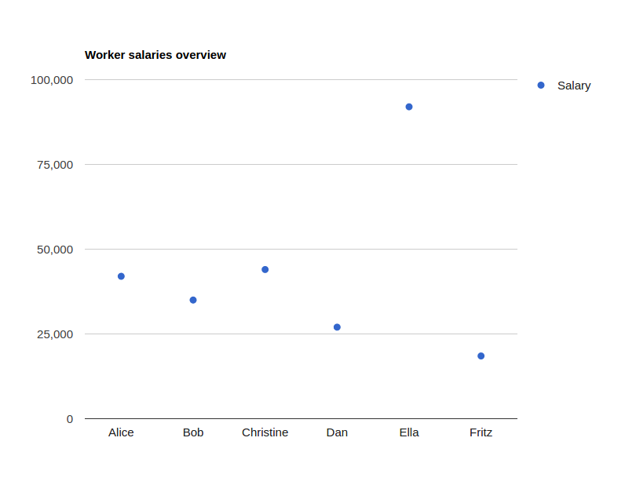
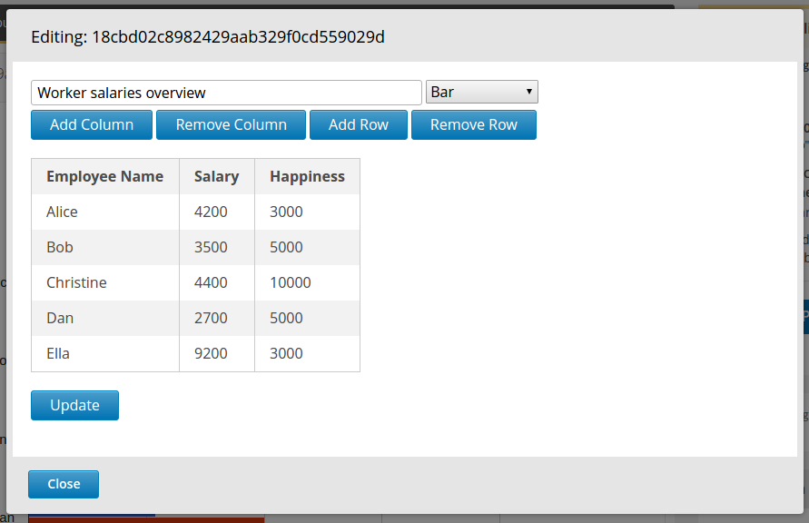
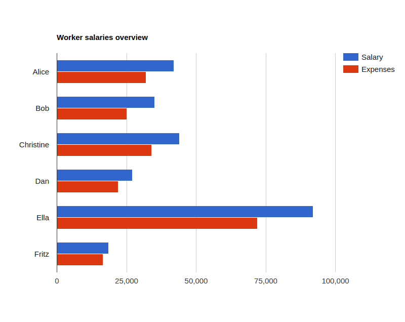

# ChartsXBlock

> Charts: Quickly and easily on your course.

This XBlock has been developed by *** and is published under the MIT license.

## Introduction

This XBLock provides a new XBlock to content authors, enabling them to implement charts into
their course, without a lot of hassle, and with a user interface to make the task as simple as it gets.

Currently, the charts provided are *area*, *bar*, *column*, *pie*, *line* and *scatter* charts. The charts are 
populated from a table easily set up by the user, and can contain values or sets, depending on the chart type.

Display of the charts themselves is powered by Google Charts, done in the colourful style of material design.

## Feature Overview

ChartsXBlock is created to enable easy data display to the author of the course, without requiring any 
previous knowledge on the topic. Simple table-styled data input lets any user interact with the 
XBlock intuitively, requiring no special knowledge to set up an interesting representation of their data.

**Warning**: These blocks currently do not support more than a single instance on a single page.

## Installation and configuration

ChartsXBlock may be installed using its setup.py, or if you prefer to use pip, running:

    pip install /path/to/xblock_poll/repo/clone

It can be installed directly from the git repo:

	pip install git+https://github.com/TinMarkovic/ChartsXBlock.git

You may specify the `-e` flag if you intend to develop on the repo.

### Setting up a course to use Charts

To enable Charts on a course, you first need to access your course's outline page - and find the
Advanced Settings button.

Once there, look for the *Advanced Modules List* and add `"chartsxblock"` to it.

Save your changes, and you may now add a chart by clicking on the **Advanced Modules** button on the bottom of a
unit editing page and selecting 'chartsxblock'.

### Chart Examples

These charts contain the same data in every instance, the default populated values. Here's an overview of all
chart types in the XBlock.

#### Area Chart

#### Bar Chart

#### Column Chart

#### Line Chart

#### Pie Chart

#### Scatter Chart

### Extending the basic example

Of course, this xblock would be useless if the data remained fixed, so the editing screen's essential
to its functionality. 

Most of the options are self-explanatory, and easily used. We recommend setting up the dimensions
before entering content. 

Clicking on any field opens up editing the field, while **Return** is used to confirm the field. 
Clicking away or pressing *Esc* undos the edit and returns it to initial value.

Pressing the Update button confirms the entered data for display.

One of the extensions to the charts is adding more datasets for each of the rows, ending up with multiple comparable values:

## Roadmap

For future features of the XBlock:

- [x] Add core functionality
- [ ] Add an advanced view (to edit values in a JSON format)
- [ ] Add extended options to further customize charts with options from Google Charts
- [ ] Enable multiple XBlocks on a single page